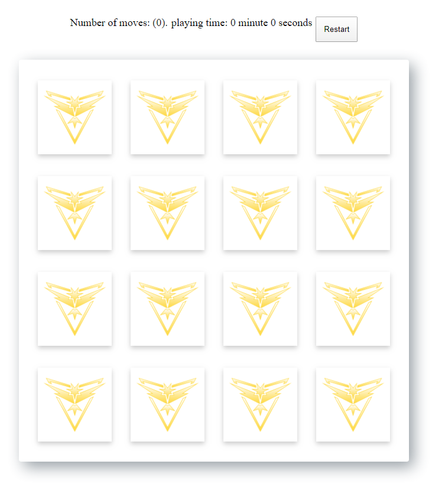

# Single player Memory card Game (4*4 board)

Concentration, also known as Match Match, Match Up, Memory, Pelmanism, Shinkei-suijaku, Pexeso or simply Pairs, is a card game in which all of the cards are laid face down on a surface and two cards are flipped face up over each turn. The object of the game is to turn over pairs of matching cards.

Responsive design. works on mobile and desktop.



[Live Demo](https://memory-card-game-756b8.firebaseapp.com/)

Game rules
  - Single player
  - one card open at a time
  - match the cards, if two cards are open
  - win, when all cards are matched
  - no time limit and no limit of number of moves

Future work
 - mulltiple player
 - add time limit
 - add moves limit.

Comment your ideas, you would like to add to the game.

# Tech stack
 - NPM package
 - Vanilla javascript (ES6)
 - Mocha
 - Webdriver.io

# Install locally

Clone repo

```
git clone https://github.com/mrakibmiah/memory-card-game.git
```

Go to the game folder

```
cd memory-card-game
```

Install

```
yarn
```

Launch game

```
yarn serve
```
The browser will open this link http://localhost:9000/

Build production

```
yarn build
```

Run unit test

```
yarn test
```

run end ot end test

```
yarn tests:e2e
```

generate e2e test report

```
yarn report:generate
```

Open e2e test report

```
yarn report:open
```

# Contribution
If you would like to contribute or do any any improvment of the code, please create a PR or contact me at rakibuiu@gmail.com